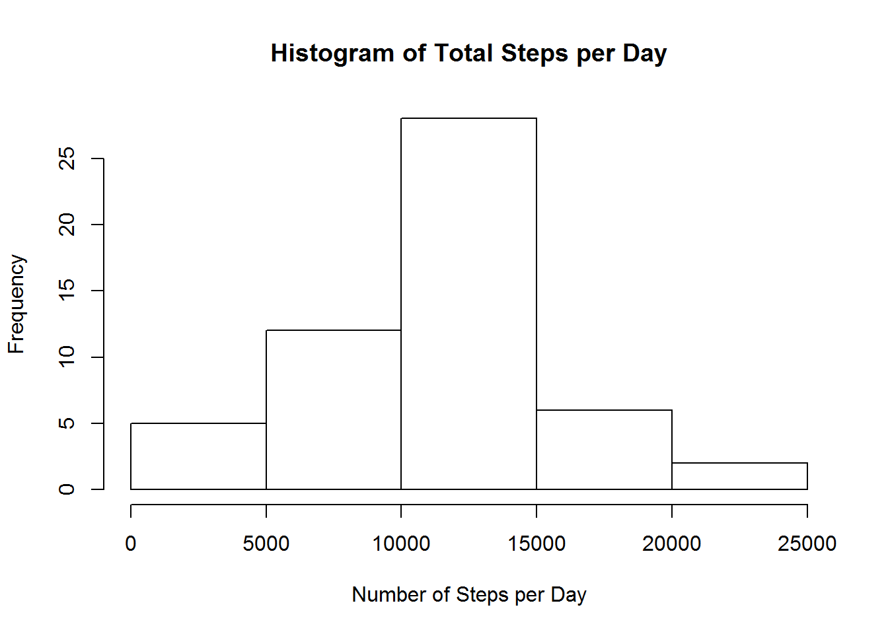
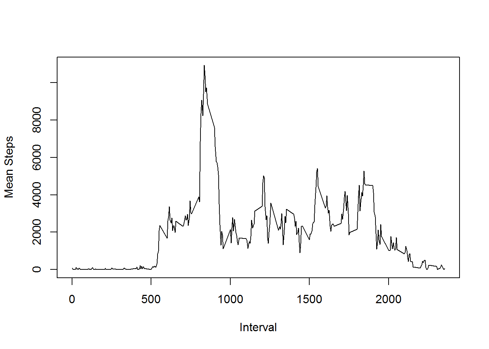
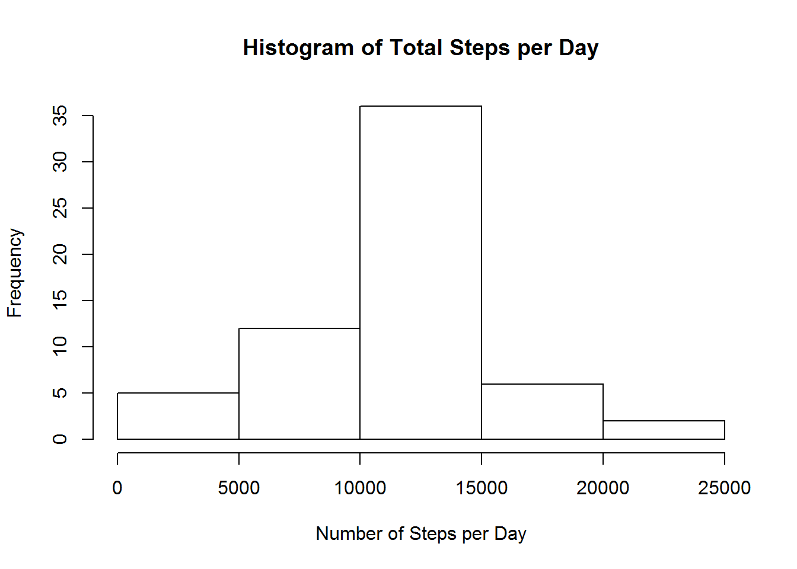
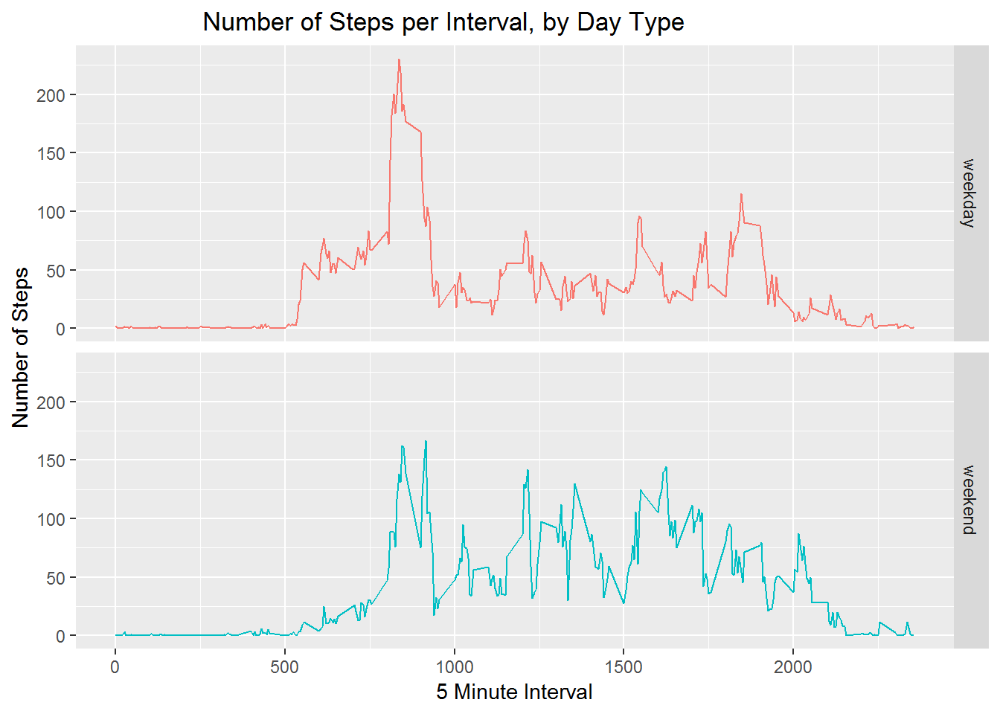

  
##Loading and preprocessing the data  
1. Load the data
2. Process and transform (if necessary) the data into a suitable format for analysis
  *italics*Load the data (i.e. read.csv())

```r
if(!file.exists("ReproducibleResearch_R")) {dir.create("ReproducibleResearch_R")}
setwd("./ReproducibleResearch_R")
fileUrl<-"https://d396qusza40orc.cloudfront.net/repdata%2Fdata%2Factivity.zip"
download.file(fileUrl, destfile="./ActivityData.zip", method="wininet")
zipF<-"./ActivityData.zip"
outDir<-"./ActivityData"
unzip(zipF, exdir=outDir)
activity<-read.csv("./ActivityData/activity.csv")
```
  
##What is the mean total number of steps taken per day? (Ignore missing values)  

1. Calculate the total number of steps taken per day
2. Make a histogram of the total number of steps taken per day
3. Calculate and report the mean and median of the total number of steps taken per day

```r
myd<-aggregate(steps ~ date, activity, sum, na.rm=TRUE)
hist(myd$steps, main="Histogram of Total Steps per Day", xlab="Number of Steps per Day")
```



```r
mean(myd$steps)
```

```
## [1] 10766.19
```

```r
median(myd$steps)
```

```
## [1] 10765
```

The mean and median number of steps taken per day are 10766.19 and 10765 respectively.
  
##What is the average daily activity pattern?  
1. Make a time series plot of the interval and mean number of steps taken
2. Which interval, on average, contains the maximum number of steps?

```r
perInterval<- aggregate(steps ~ interval, activity, sum, na.rm=TRUE)
#library(ggplot2)
#ggplot(perInterval, aes(interval, steps)) + geom_line()
plot(perInterval$interval, perInterval$steps, type="l", xlab="Interval", ylab="Mean Steps")
```



```r
perInterval$interval[which.max(perInterval$steps)]
```

```
## [1] 835
```
The 5-minute interval with the maximum average number of steps is 835.
  
##Imputing missing values  
1. Calculate and report the total number of missing values 
2. Devise a strategy for filling in all of the missing values in the dataset 3. Create a new dataset with the missing data filled in
4. Make a histogram of the total number of steps taken each day and calculate the mean and median. Do these values differ from the estimates made above? What is the impact of imputing missing data on the estimates?

```r
sum(is.na(activity$steps))
```

```
## [1] 2304
```

```r
#impute using similar case imputation (mean for that 5 minute interval)
library(dplyr)

impute.mean <- function(x) {
  a <- mean(x, na.rm = TRUE)
  return (ifelse (is.na(x) == TRUE , a, x)) 
 }

activityImputed <- activity %>%
    group_by(interval) %>%
    mutate(
        steps = impute.mean(steps)
    )
stepsPerDayImputed<-aggregate(steps ~ date, activityImputed, sum)
hist(stepsPerDayImputed$steps, xlab="Number of Steps per Day", main="Histogram of Total Steps per Day")
```



```r
mean(stepsPerDayImputed$steps)
```

```
## [1] 10766.19
```

```r
median(stepsPerDayImputed$steps)
```

```
## [1] 10766.19
```
There are 2304 missing values in the dataset.  
  
The mean and median total number of steps taken each day is 10,766.19 when the data is imputed with mean steps per interval. These values have not greatly changed as a result of the imputation applied - only the median is 0.19 steps higher.  
  
Using mean interval results to impute missing data results in smaller variation of the distribution because more data points are equal to the mean.
  
##Are there differences in activity patterns between weekdays and weekends?
  
1. Create a new factor variable in the dataset with two levels - "weekday" and "weekend" indicating whether a given date is a weekday or weekend day.

```r
dayType<- function(date_val) {
   wd<- weekdays(as.Date(date_val, '%Y-%m-%d'))
   if (!(wd == 'Saturday' || wd == 'Sunday')) {
      x <- 'weekday'
   } else {
      x<- 'weekend'
   }
   x
}
activityImputed$daytype<- as.factor(sapply(activity$date, dayType))
```
2. Make a panel plot containing a time series plot of the 5-minute interval (x-axis) and the average number of steps taken, averaged across all weekday days or weekend days (y-axis).

```r
library(ggplot2)
#aggregate by interval and daytype
stepsPerDayTypeImputed<-aggregate(steps ~ interval + daytype, activityImputed, mean)
#create a plot
ggplot(stepsPerDayTypeImputed, aes(interval, steps)) +
   facet_grid(daytype ~.) +
   geom_line(aes(colour=daytype)) +
   theme(legend.position="none") +
   ggtitle("                 Number of Steps per Interval, by Day Type") +
   labs(x="5 Minute Interval", y="Number of Steps")
```


  
  The activity is different depending on the type of day. More steps are taken early in the morning on weekdays, and the spread of steps across the intervals is more even at the weekend. More steps are taken overall at the weekend.
